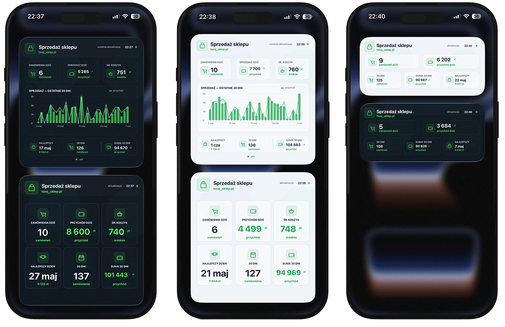
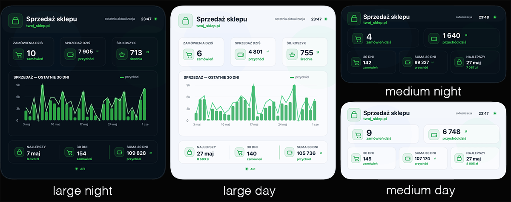
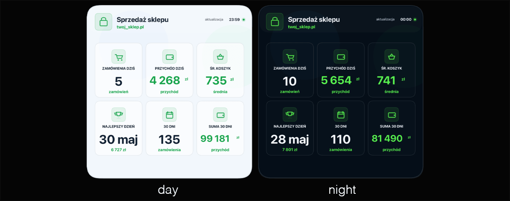

# scriptable-shoper



# Widget Shoper dla Scriptable

Widget pokazuje podstawowe dane sprzedażowe z API Shopera bezpośrednio na ekranie iPhone’a lub iPada.

Pokazywane dane:

- liczba zamówień dzisiaj,
- sprzedaż dzisiaj,
- średni koszyk,
- wykres sprzedaży z ostatnich 30 dni.

---

## Dostępne wersje skryptu

W repozytorium znajdują się dwie wersje widgetu:


| Plik | Rozmiary widgetu | Motywy |
|---|---|---|
| [shoper_1.js](widgety/shoper_1.js) | `medium` lub `large` | `day` lub `night` |
| [shoper_big.js](widgety/shoper_big.js) | tylko `large` | `day` lub `night` |

### `shoper_1.js`

To główna, bardziej uniwersalna wersja widgetu. w wersji `large` posiada wykres z ostatnich 30 dni.

Pozwala zmieniać:

```javascript
const WIDGET_SIZE = "medium" // "medium" albo "large"
const THEME = "night" // "night" albo "day"
```

Możesz więc używać tego samego skryptu jako widgetu średniego albo dużego.

### `shoper_big.js`

To wersja przygotowana wyłącznie pod duży widget. Nie posiada wykresu, a dane na nim przedstawione są czytelniejsze

Ten plik obsługuje tylko rozmiar:

```javascript
const WIDGET_SIZE = "large"
```

Nie ma wersji `medium`.

Można natomiast zmieniać motyw:

```javascript
const THEME = "night" // "night" albo "day"
```

---

# Instrukcja instalacji widgetu Shoper w Scriptable

## 1. Wymagania

Do działania potrzebujesz:

- iPhone’a lub iPada,
- aplikacji **Scriptable** z App Store,
- danych API Shopera:
  - **Client ID**,
  - **Token API**,
- jednego z gotowych skryptów JS z tego repozytorium.

---

## 2. Przygotowanie danych API w Shoperze

W panelu Shopera wygeneruj dane dla zewnętrznej aplikacji API.

Wymagane uprawnienia:

| Obszar | Uprawnienie |
|---|---|
| Zamówienia | Odczyt |

Po wygenerowaniu danych zapisz sobie:

```text
Client ID
Token API
```

Nie wrzucaj tych danych bezpośrednio do skryptu!

---

## 3. Zapisanie Client ID i Token API w Keychain Scriptable

W Scriptable utwórz nowy skrypt, np.:

```text
Shoper API Keychain Setup
```

Wklej do niego:

```javascript
Keychain.set("shoper_client_id", "TUTAJ_WKLEJ_CLIENT_ID")
Keychain.set("shoper_api_token", "TUTAJ_WKLEJ_TOKEN_API")
```

Przykład:

```javascript
Keychain.set("shoper_client_id", "abc123")
Keychain.set("shoper_api_token", "token_z_panelu_shopera")
```

Uruchom ten skrypt **raz** przyciskiem ▶️.

Po uruchomieniu dane zostaną zapisane w Keychain aplikacji Scriptable i główny widget będzie mógł je odczytać przez:

```javascript
const SHOPER_CLIENT_ID_KEY = "shoper_client_id"
const SHOPER_API_TOKEN_KEY = "shoper_api_token"
```

---

## 4. Przygotowanie głównego skryptu widgetu

W Scriptable utwórz drugi skrypt, np.:

```text
Shoper Widget
```

Wklej do niego cały kod wybranego widgetu:

- `shoper_1.js` — jeżeli chcesz mieć możliwość wyboru `medium` albo `large`,
- `shoper_big.js` — jeżeli chcesz używać tylko dużego widgetu.

Na początku skryptu ustaw najważniejsze opcje.

Dla `shoper_1.js`:

```javascript
const WIDGET_SIZE = "medium" // "medium" albo "large"
const THEME = "night" // "night" albo "day"

const USE_DEMO_DATA = false // true = dane testowe, false = dane z API Shopera

const SHOP_BASE_URL = "https://domena_twojego_sklepu.pl"
```

Jeżeli chcesz wersję dużą w `shoper_1.js`, zmień:

```javascript
const WIDGET_SIZE = "large"
```

Jeżeli chcesz jasny motyw pod iOS, zmień:

```javascript
const THEME = "day"
```

Dla `shoper_big.js` rozmiar widgetu jest ustawiony na `large`. Możesz zmieniać motyw oraz tryb danych demo:

```javascript
const THEME = "night" // "night" albo "day"
const USE_DEMO_DATA = false // true = dane testowe, false = dane z API Shopera
```

Adres sklepu ustaw w obu wersjach tak samo:

```javascript
const SHOP_BASE_URL = "https://domena_twojego_sklepu.pl"
```

Przykład:

```javascript
const SHOP_BASE_URL = "https://twojsklep.pl"
```

---

## 5. Tryb danych demo

W obu wersjach widgetu można użyć trybu demonstracyjnego:

```javascript
const USE_DEMO_DATA = true
```

Domyślnie tryb demo powinien być wyłączony:

```javascript
const USE_DEMO_DATA = false
```

Tryb demo służy do testowania wyglądu widgetu bez łączenia się z API Shopera. Po ustawieniu:

```javascript
const USE_DEMO_DATA = true
```

widget pokaże przykładowe dane sprzedażowe zamiast prawdziwych danych z API.

To przydatne, gdy chcesz:

- sprawdzić wygląd widgetu przed podłączeniem API,
- zrobić zrzut ekranu do README,
- przetestować wersję `day` albo `night`,
- sprawdzić układ `medium` albo `large`,
- pokazać widget komuś bez udostępniania danych sprzedażowych.

W normalnym użyciu zostaw:

```javascript
const USE_DEMO_DATA = false
```

---

## 6. Test działania w Scriptable

Po wklejeniu kodu uruchom skrypt w Scriptable przyciskiem ▶️.

Jeżeli wszystko działa, zobaczysz podgląd widgetu.

Jeżeli pojawi się błąd, sprawdź:

- czy `SHOP_BASE_URL` jest poprawny,
- czy Client ID i Token API są zapisane w Keychain,
- czy token API ma dostęp do zamówień,
- czy sklep ma aktywne API,
- czy endpoint `/webapi/rest/orders` działa,
- czy `USE_DEMO_DATA` nie jest przypadkiem ustawione na `true`, jeśli oczekujesz prawdziwych danych.

---

## 7. Dodanie widgetu na ekran iPhone’a

1. Przytrzymaj palec na ekranie głównym iPhone’a.
2. Kliknij `+` w lewym górnym rogu.
3. Wyszukaj **Scriptable**.
4. Wybierz rozmiar widgetu:
   - **Medium** — dla `shoper_1.js` z ustawieniem `WIDGET_SIZE = "medium"`,
   - **Large** — dla `shoper_1.js` z ustawieniem `WIDGET_SIZE = "large"` albo dla `shoper_big.js`.
5. Dodaj widget do ekranu.
6. Przytrzymaj widget i wybierz **Edit Widget**.
7. W polu **Script** wybierz swój skrypt, np. `Shoper Widget`.

---

## 8. Najczęstsze problemy

### Widget pokazuje dane przykładowe zamiast prawdziwych

Najczęściej oznacza to, że w kodzie aktywny jest tryb demo:

```javascript
const USE_DEMO_DATA = true
```

Aby pobierać prawdziwe dane z API Shopera, ustaw:

```javascript
const USE_DEMO_DATA = false
```

---

### Widget pokazuje `0 zł`

Możliwe przyczyny:

- sklep nie miał sprzedaży w ostatnich 30 dniach,
- API zwraca inne pola kwoty lub daty,
- token nie ma dostępu do zamówień,
- filtr daty w API nie działa poprawnie,
- `USE_DEMO_DATA` jest ustawione na `false`, ale API nie zwraca danych.

Wtedy w kodzie ustaw tymczasowo:

```javascript
const DEBUG_API = true
```

Uruchom skrypt w Scriptable i sprawdź logi.

---

### Błąd 401 / 403

Najczęściej oznacza:

- błędny Client ID,
- błędny Token API,
- brak uprawnień do zamówień,
- token został usunięty lub wygasł.

---

### Błąd 404

Najczęściej oznacza:

- zły adres sklepu w `SHOP_BASE_URL`,
- API nie działa pod podanym adresem,
- endpoint `/webapi/rest/orders` jest niedostępny,
- Shoper odrzucił parametry filtrowania.

---

## 9. Bezpieczeństwo

Nie zapisuj danych API w pliku JS, który trafia na GitHub.

Zawsze używaj Keychain:

```javascript
Keychain.set("shoper_client_id", "...")
Keychain.set("shoper_api_token", "...")
```

Dzięki temu repozytorium może być publiczne, a dane API pozostają tylko na Twoim urządzeniu.

Tryb demo nie wymaga danych API, ale nie zastępuje prawdziwej integracji z Shoperem. Służy wyłącznie do testowania wyglądu i prezentacji widgetu.

---

## 10. Opcje modyfikacji

### `shoper_1.js`

| Zmienna | Wartość |
|---|---|
| `WIDGET_SIZE` | `medium` lub `large` |
| `THEME` | `night` lub `day` |
| `USE_DEMO_DATA` | `false` lub `true` |
| `DAYS_TO_SHOW` | `30` |
| `REFRESH_MINUTES` | `120` |

### `shoper_big.js`

| Zmienna | Wartość |
|---|---|
| `WIDGET_SIZE` | tylko `large` |
| `THEME` | `night` lub `day` |
| `USE_DEMO_DATA` | `false` lub `true` |
| `DAYS_TO_SHOW` | `30` |
| `REFRESH_MINUTES` | `120` |

---
