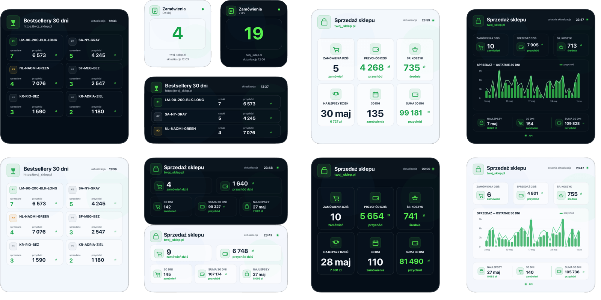
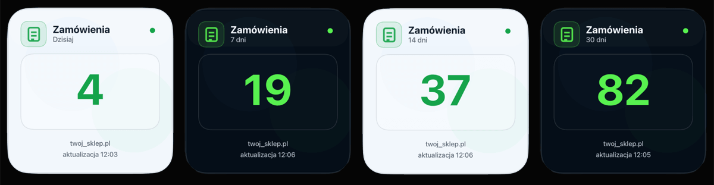
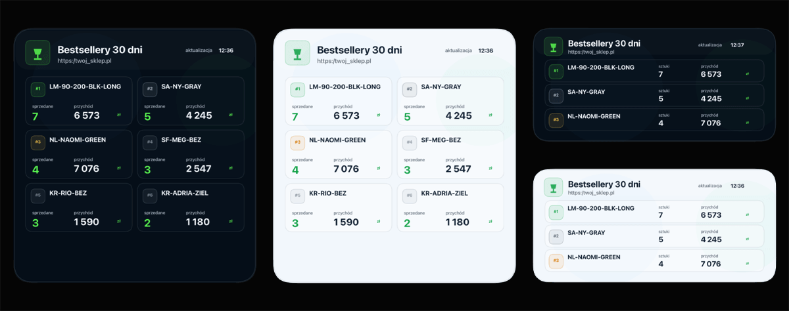

[](https://scriptable.app/)
[](https://developers.shoper.pl/)
[](LICENSE)
[](docs/INSTALACJA_SCRIPTABLE.md)

# scriptable-shoper



## Widgety Shoper dla Scriptable

Widgety pokazują najważniejsze z punktu widzenia właściciela, administratora lub marketingowca dane z API Shopera bezpośrednio na ekranie iPhone’a lub iPada.

Czas odświeżania każdego widgetu można ustawić w skrypcie za pomocą zmiennej:

```javascript
const REFRESH_MINUTES = 120
```

Odświeżenie można też wymusić ręcznie z poziomu aplikacji Scriptable.

---

## Spis treści

- [Kategorie widgetów](#kategorie-widgetów)
  - [Sprzedaż](#sprzedaż)
    - [`shoper_1.js`](#shoper_1js)
    - [`shoper_big.js`](#shoper_bigjs)
    - [`shoper_licznik_small.js`](#shoper_licznik_smalljs)
    - [`shoper_bestsellery.js`](#shoper_bestselleryjs)
- [Wymagane uprawnienia API](#wymagane-uprawnienia-api)
- [Instalacja](#instalacja)
- [Opcje modyfikacji](#opcje-modyfikacji)
- [Bezpieczeństwo](#bezpieczeństwo)
- [Licencja](#licencja)

---

## Kategorie widgetów

### Sprzedaż

Widgety z tej kategorii pokazują dane sprzedażowe sklepu, takie jak:

- liczba zamówień dzisiaj,
- sprzedaż dzisiaj,
- średni koszyk,
- podsumowanie ostatnich 30 dni,
- wykres sprzedaży z ostatnich 30 dni — dostępny w wybranych wersjach,
- licznik zamówień z wybranego zakresu czasu,
- najlepiej sprzedające się produkty z ostatnich 30 dni.

| Plik | Kategoria | Rozmiary widgetu | Motywy | Opis |
|---|---|---|---|---|
| [shoper_1.js](widgety/shoper_1.js) | Sprzedaż | `medium` / `large` | `day` / `night` | Uniwersalna wersja widgetu. W trybie `large` zawiera wykres sprzedaży z ostatnich 30 dni. |
| [shoper_big.js](widgety/shoper_big.js) | Sprzedaż | `large` | `day` / `night` | Duży, czytelny widget sprzedażowy bez wersji `medium`. |
| [shoper_licznik_small.js](widgety/shoper_licznik_small.js) | Sprzedaż | `small` | `day` / `night` | Mały licznik zamówień z wybranego zakresu: dzisiaj, 7 dni, 14 dni albo 30 dni. |
| [shoper_bestsellery.js](widgety/shoper_bestsellery.js) | Sprzedaż | `medium` / `large` | `day` / `night` | Ranking najlepiej sprzedających się produktów z ostatnich 30 dni. |

---

## Dostępne widgety sprzedażowe

### `shoper_1.js`


To główna, bardziej uniwersalna wersja widgetu.

Pozwala zmieniać rozmiar:

```javascript
const WIDGET_SIZE = "medium" // "medium" albo "large"
```

Pozwala też zmieniać motyw:

```javascript
const THEME = "night" // "night" albo "day"
```

W wersji `large` widget posiada wykres sprzedaży z ostatnich 30 dni.

---

### `shoper_big.js`


To wersja przygotowana wyłącznie pod duży widget.

Ten plik obsługuje tylko rozmiar:

```javascript
const WIDGET_SIZE = "large"
```

Można natomiast zmieniać motyw:

```javascript
const THEME = "night" // "night" albo "day"
```

`shoper_big.js` nie posiada wersji `medium`. Dane są przedstawione w dużym, czytelnym układzie.

---

### `shoper_licznik_small.js`



To mały widget sprzedażowy przygotowany wyłącznie pod rozmiar `small`.

Widget pokazuje liczbę zamówień z wybranego zakresu czasu. Zakres ustawiasz w skrypcie za pomocą zmiennej:

```javascript
const ORDERS_RANGE = "today"
```

Dostępne zakresy:

| Wartość `ORDERS_RANGE` | Zakres danych |
|---|---|
| `"today"` | zamówienia z dzisiaj |
| `"7d"` | zamówienia z ostatnich 7 dni |
| `"14d"` | zamówienia z ostatnich 14 dni |
| `"30d"` | zamówienia z ostatnich 30 dni |

Widget obsługuje motyw jasny i ciemny:

```javascript
const THEME = "night" // "night" albo "day"
```

Domyślny czas odświeżania:

```javascript
const REFRESH_MINUTES = 120
```

---

### `shoper_bestsellery.js`

Widget pokazuje najlepiej sprzedające się produkty z ostatnich 30 dni na podstawie danych pobieranych z API Shopera.

Ranking tworzony jest według liczby sprzedanych sztuk. Przy każdym produkcie wyświetlane są:

- pozycja w rankingu,
- SKU produktu,
- liczba sprzedanych sztuk,
- wartość sprzedaży.

Widget obsługuje rozmiary:

```javascript
const WIDGET_SIZE = "medium" // "medium" albo "large"
```

Widget obsługuje motyw jasny i ciemny:

```javascript
const THEME = "night" // "night" albo "day"
```

Domyślny czas odświeżania:

```javascript
const REFRESH_MINUTES = 120
```

---

## Wymagane uprawnienia API

Wymagane uprawnienia zależą od konkretnego widgetu.

<table>
  <thead>
    <tr>
      <th>Widget</th>
      <th>Kategoria widgetu</th>
      <th>Obszar API Shopera</th>
      <th>Wymagane uprawnienie</th>
      <th>Do czego służy</th>
    </tr>
  </thead>
  <tbody>
    <tr>
      <td><code>shoper_1.js</code></td>
      <td>Sprzedaż</td>
      <td>Zamówienia / Orders</td>
      <td>Odczyt</td>
      <td>Pobieranie danych sprzedażowych i zamówień z ostatnich 30 dni.</td>
    </tr>
    <tr>
      <td><code>shoper_big.js</code></td>
      <td>Sprzedaż</td>
      <td>Zamówienia / Orders</td>
      <td>Odczyt</td>
      <td>Pobieranie danych sprzedażowych i zamówień z ostatnich 30 dni.</td>
    </tr>
    <tr>
      <td><code>shoper_licznik_small.js</code></td>
      <td>Sprzedaż</td>
      <td>Zamówienia / Orders</td>
      <td>Odczyt</td>
      <td>Pobieranie liczby zamówień z wybranego zakresu czasu.</td>
    </tr>
    <tr>
      <td rowspan="3"><code>shoper_bestsellery.js</code></td>
      <td rowspan="3">Sprzedaż</td>
      <td>Zamówienia / Orders</td>
      <td>Odczyt</td>
      <td>Pobieranie zamówień z ostatnich 30 dni.</td>
    </tr>
    <tr>
      <td>Produkty w zamówieniach / Order products</td>
      <td>Odczyt</td>
      <td>Sprawdzanie, które produkty zostały sprzedane i w jakiej ilości.</td>
    </tr>
    <tr>
      <td>Produkty / Products</td>
      <td>Odczyt</td>
      <td>Pobieranie SKU produktu oraz sprawdzanie, czy produkt jest aktywny.</td>
    </tr>
  </tbody>
</table>


Nie nadawaj aplikacji większych uprawnień, niż są potrzebne do działania wybranego widgetu.

---

## Instalacja

Pełna instrukcja instalacji widgetów w aplikacji Scriptable znajduje się tutaj:

[Instrukcja instalacji widgetów Shoper w Scriptable](docs/INSTALACJA_SCRIPTABLE.md)

Instrukcja zawiera:

- wymagania,
- przygotowanie danych API w Shoperze,
- zapisanie Client ID i Token API w Keychain Scriptable,
- konfigurację skryptu,
- tryb danych demo,
- dodanie widgetu na ekran iPhone’a,
- opis najczęstszych problemów.

---

## Opcje modyfikacji

### `shoper_1.js`

| Zmienna | Wartość |
|---|---|
| `WIDGET_SIZE` | `medium` lub `large` |
| `THEME` | `night` lub `day` |
| `USE_DEMO_DATA` | `false` lub `true` |
| `DAYS_TO_SHOW` | `30` |
| `REFRESH_MINUTES` | `120` |

### `shoper_big.js`

| Zmienna | Wartość |
|---|---|
| `WIDGET_SIZE` | tylko `large` |
| `THEME` | `night` lub `day` |
| `USE_DEMO_DATA` | `false` lub `true` |
| `DAYS_TO_SHOW` | `30` |
| `REFRESH_MINUTES` | `120` |

### `shoper_licznik_small.js`

| Zmienna | Wartość |
|---|---|
| `WIDGET_SIZE` | tylko `small` |
| `THEME` | `night` lub `day` |
| `ORDERS_RANGE` | `today`, `7d`, `14d` lub `30d` |
| `USE_DEMO_DATA` | `false` lub `true` |
| `REFRESH_MINUTES` | `120` |

### `shoper_bestsellery.js`

| Zmienna | Wartość |
|---|---|
| `WIDGET_SIZE` | `medium` lub `large` |
| `THEME` | `night` lub `day` |
| `USE_DEMO_DATA` | `false` lub `true` |
| `DAYS_TO_SHOW` | `30` |
| `REFRESH_MINUTES` | `120` |

---

## Bezpieczeństwo

Nie zapisuj danych API bezpośrednio w pliku JS.

Zawsze używaj Keychain Scriptable:

```javascript
Keychain.set("shoper_client_id", "...")
Keychain.set("shoper_api_token", "...")
```

Dzięki temu zmniejszasz szanse na ich ujawnienie, nawet w przypadku utraty telefonu/tableta.

---

## Licencja

Projekt jest udostępniony na licencji MIT. Szczegóły znajdziesz w pliku [LICENSE](LICENSE).
